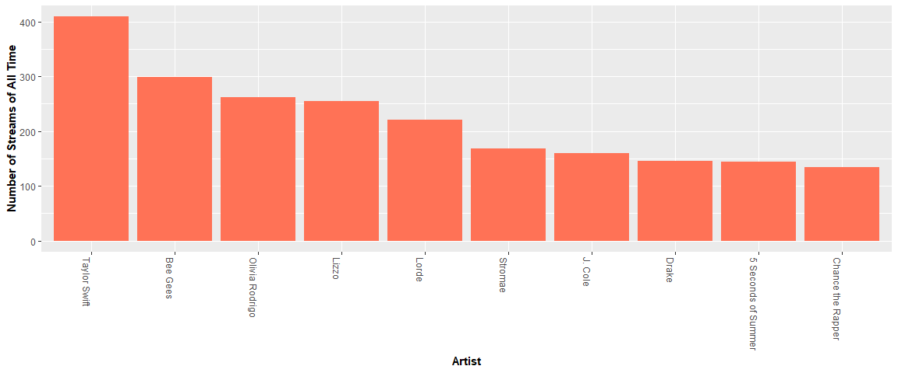

<!-- README.md is generated from README.Rmd. Please edit that file -->

# myspotify 

<!-- badges: start -->

[](https://lifecycle.r-lib.org/articles/stages.html#experimental)
[](https://CRAN.R-project.org/package=myspotify)
[](https://github.com/audreykim640/myspotify/actions/workflows/R-CMD-check.yaml)
<!-- badges: end -->

The goal of `myspotify` is to to read personal Spotify data and complete
a series of analyses. Spotify is a popular music and podcast streaming
app globally.

## What’s this package for?

Spotify, a popular music streaming platform, offers users the option to
download their personal usage history data. `myspotify` seeks to provide
tools to allow users to read and visualize their data to learn more
about their listening habits. The idea is somewhat similar to “Spotify
Wrapped,” a personalized summary that Spotify releases annually, but
this can assess history beyond just a year and allows the user to delve
into the patterns of the songs they listen to on Spotify.

## Who should use this package?

Anyone who uses Spotify, wants to learn more about their listening
habits, and has a basic background in (or is willing to learn!) R.

“Basic background” might include understanding variable assignment
(`<-`) and various Tidyverse packages like dplyr and ggplot2. Tidyverse
familiarity is not necessary but would allow for more data exploration
opportunities.

## How to install this package?

You can install the development version of myspotify from
[GitHub](https://github.com/) with:

``` r
# install.packages("devtools")
devtools::install_github("audreykim640/myspotify")
#> Skipping install of 'myspotify' from a github remote, the SHA1 (c1594c47) has not changed since last install.
#>   Use `force = TRUE` to force installation
```

## What datasets are there?

- `extended_example`: example dataset of Spotify listening history from
  one of the authors
- Load your own!
  - After loading the package and downloading your data from Spotify and
    read the files into R (instructions
    [here](https://github.com/audreykim640/myspotify/blob/main/vignettes/myspotify.Rmd))

## Example data

``` r
extended_example %>% 
  head()
#>         date                time ms_played                  song
#> 1 2022-03-30 2022-11-17 00:44:38      1965                Sue Me
#> 2 2019-11-22 2022-11-17 02:14:01    222951   Cat's in the Cradle
#> 3 2021-11-02 2022-11-17 15:55:07    203444            Homecoming
#> 4 2022-07-30 2022-11-17 12:44:44    123949         don't miss me
#> 5 2022-07-17 2022-11-17 14:43:40    159836     abcdefu (angrier)
#> 6 2019-10-07 2022-11-17 03:38:32    253920 Every Breath You Take
#>              artist                 album reason_start reason_end year
#> 1 Sabrina Carpenter        Singular Act I       remote    endplay 2022
#> 2      Harry Chapin Verities & Balderdash    trackdone  trackdone 2019
#> 3        Kanye West            Graduation    trackdone  trackdone 2021
#> 4 Claire Rosinkranz         don’t miss me    trackdone  trackdone 2022
#> 5             GAYLE     abcdefu (angrier)    trackdone  trackdone 2022
#> 6        The Police         Synchronicity    trackdone  trackdone 2019
```

## Example function uses

``` r
#Search for a specific word or phrase in a song name 
#Returns a data frame

search_word(extended_example, "Christmas")
#>                             song       artist                   album
#> 1 Cuddle Up, Cozy Down Christmas Dolly Parton A Holly Dolly Christmas
#> 2                 Last Christmas        Wham!          LAST CHRISTMAS

# Returns all songs streamed with "Christmas" in the title
```

``` r
# Make a plot of the top ten artists/bands you have streamed of all time

most_played_artists(extended_example)
#> [1] "Your most played artist of all time is Taylor Swift! Followed by (the)Bee Gees and Olivia Rodrigo"
```



## Note about testing

There’s a test for the dataset in this package, but the rest of the
package (functions) return plots. We did not write tests for these, as
the suggested package, `vdiff`, does not exist for our working version
of R.
